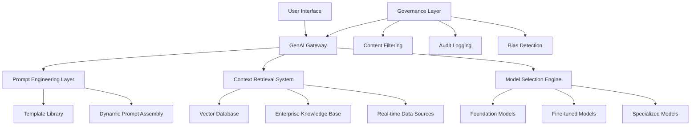

# Generative AI in Enterprise: Patterns Beyond the Hype

Generative AI represents a paradigm shift in enterprise software, but successful implementation requires moving beyond proof-of-concepts to production-ready patterns that deliver measurable business value.

## Enterprise GenAI Architecture



## Production-Ready Patterns

### 1. Retrieval-Augmented Generation (RAG) for Enterprise Knowledge

**Use Case:** Intelligent document search and synthesis for SAP implementations

**Architecture:**
```python
class EnterpriseRAGSystem:
    def __init__(self):
        self.vector_store = ChromaDB()
        self.embeddings = OpenAIEmbeddings()
        self.llm = ChatOpenAI(model="gpt-4-turbo")
        self.retriever = self.vector_store.as_retriever(
            search_kwargs={"k": 5, "score_threshold": 0.7}
        )
    
    async def query_knowledge_base(self, question: str, context: dict) -> str:
        # Add enterprise context to query
        enhanced_query = self.enhance_query_with_context(question, context)
        
        # Retrieve relevant documents
        relevant_docs = await self.retriever.aget_relevant_documents(enhanced_query)
        
        # Filter by user permissions
        authorized_docs = self.filter_by_permissions(relevant_docs, context['user_id'])
        
        # Generate response with citations
        response = await self.generate_response_with_citations(
            question, authorized_docs, context
        )
        
        # Log interaction for audit
        await self.log_interaction(question, response, context)
        
        return response
    
    def enhance_query_with_context(self, question: str, context: dict) -> str:
        """Add business context to improve retrieval accuracy"""
        context_prompt = f"""
        User Role: {context.get('role', 'unknown')}
        Business Unit: {context.get('business_unit', 'unknown')}
        Current Project: {context.get('project', 'unknown')}
        
        Question: {question}
        """
        return context_prompt
    
    async def generate_response_with_citations(self, question: str, docs: list, context: dict) -> dict:
        """Generate response with proper citations and confidence scoring"""
        
        # Prepare context from retrieved documents
        doc_context = "\n\n".join([
            f"Document {i+1}: {doc.page_content}\nSource: {doc.metadata['source']}"
            for i, doc in enumerate(docs)
        ])
        
        # Create prompt with enterprise guidelines
        prompt = f"""
        You are an SAP implementation expert. Answer the question based on the provided documents.
        
        Guidelines:
        - Only use information from the provided documents
        - Include specific citations [Doc X] for each claim
        - If information is insufficient, clearly state limitations
        - Provide actionable recommendations when possible
        - Consider the user's role: {context.get('role')}
        
        Context Documents:
        {doc_context}
        
        Question: {question}
        
        Response:
        """
        
        response = await self.llm.agenerate([prompt])
        
        return {
            "answer": response.generations[0][0].text,
            "sources": [doc.metadata for doc in docs],
            "confidence": self.calculate_confidence(docs, question),
            "timestamp": datetime.utcnow().isoformat()
        }
```

### 2. Fine-Tuned Models for Domain-Specific Tasks

**Use Case:** SAP configuration code generation

**Training Pipeline:**
```python
class SAPConfigurationTuner:
    def __init__(self):
        self.base_model = "codellama/CodeLlama-7b-Instruct-hf"
        self.training_data_path = "sap_config_examples.jsonl"
    
    def prepare_training_data(self):
        """Prepare SAP configuration examples for fine-tuning"""
        examples = []
        
        # Load SAP configuration patterns
        with open(self.training_data_path, 'r') as f:
            for line in f:
                example = json.loads(line)
                
                # Format for instruction tuning
                formatted_example = {
                    "instruction": f"Generate SAP {example['component']} configuration for: {example['requirement']}",
                    "input": example['business_context'],
                    "output": example['configuration_code']
                }
                examples.append(formatted_example)
        
        return examples
    
    async def fine_tune_model(self):
        """Fine-tune model for SAP configuration generation"""
        
        # Prepare dataset
        training_data = self.prepare_training_data()
        
        # Configure training parameters
        training_config = {
            "model_name": self.base_model,
            "dataset": training_data,
            "num_epochs": 3,
            "learning_rate": 2e-5,
            "batch_size": 4,
            "max_length": 2048,
            "validation_split": 0.1
        }
        
        # Start training job
        training_job = await self.start_training(training_config)
        
        # Monitor training progress
        while not training_job.is_complete():
            metrics = await training_job.get_metrics()
            print(f"Loss: {metrics['loss']}, Accuracy: {metrics['accuracy']}")
            await asyncio.sleep(60)
        
        # Evaluate model performance
        evaluation_results = await self.evaluate_model(training_job.model_id)
        
        if evaluation_results['sap_accuracy'] > 0.85:
            await self.deploy_model(training_job.model_id, "production")
        
        return training_job
    
    async def generate_sap_config(self, requirement: str, context: dict) -> dict:
        """Generate SAP configuration using fine-tuned model"""
        
        prompt = f"""
        Generate SAP configuration for the following requirement:
        
        Requirement: {requirement}
        SAP Module: {context.get('module', 'Unknown')}
        Business Process: {context.get('process', 'Unknown')}
        Environment: {context.get('environment', 'Development')}
        
        Configuration:
        """
        
        response = await self.model.generate(
            prompt,
            max_tokens=1024,
            temperature=0.1,  # Low temperature for consistent code generation
            stop_sequences=["---END---"]
        )
        
        # Validate generated configuration
        validation_result = await self.validate_sap_config(response.text)
        
        return {
            "configuration": response.text,
            "validation": validation_result,
            "confidence": response.confidence,
            "tokens_used": response.usage.total_tokens
        }
```

### 3. Multi-Agent Systems for Complex Business Processes

**Use Case:** Automated SAP implementation planning

```python
class SAPImplementationPlanner:
    def __init__(self):
        self.agents = {
            "business_analyst": BusinessAnalystAgent(),
            "technical_architect": TechnicalArchitectAgent(), 
            "project_manager": ProjectManagerAgent(),
            "quality_assurance": QualityAssuranceAgent()
        }
        self.coordinator = CoordinatorAgent()
    
    async def create_implementation_plan(self, requirements: dict) -> dict:
        """Orchestrate multiple AI agents to create comprehensive implementation plan"""
        
        # Phase 1: Business Analysis
        business_analysis = await self.agents["business_analyst"].analyze_requirements(requirements)
        
        # Phase 2: Technical Architecture
        technical_design = await self.agents["technical_architect"].design_solution(
            requirements, business_analysis
        )
        
        # Phase 3: Project Planning
        project_plan = await self.agents["project_manager"].create_project_plan(
            requirements, business_analysis, technical_design
        )
        
        # Phase 4: Quality Review
        quality_review = await self.agents["quality_assurance"].review_plan(
            business_analysis, technical_design, project_plan
        )
        
        # Phase 5: Coordination and Optimization
        final_plan = await self.coordinator.optimize_plan(
            business_analysis, technical_design, project_plan, quality_review
        )
        
        return final_plan

class BusinessAnalystAgent:
    def __init__(self):
        self.llm = ChatOpenAI(model="gpt-4-turbo")
        self.tools = [
            RequirementsAnalysisTool(),
            StakeholderMappingTool(),
            ProcessMappingTool()
        ]
    
    async def analyze_requirements(self, requirements: dict) -> dict:
        """Analyze business requirements and identify key processes"""
        
        analysis_prompt = f"""
        As a senior SAP business analyst, analyze the following requirements:
        
        {json.dumps(requirements, indent=2)}
        
        Provide:
        1. Business process mapping
        2. Stakeholder analysis
        3. Success criteria definition
        4. Risk assessment
        5. Integration requirements
        
        Format your response as structured JSON.
        """
        
        response = await self.llm.agenerate([analysis_prompt])
        
        # Parse and validate response
        analysis = json.loads(response.generations[0][0].text)
        
        # Enrich with tool-based analysis
        analysis["process_flows"] = await self.tools[2].map_processes(requirements)
        analysis["stakeholder_matrix"] = await self.tools[1].map_stakeholders(requirements)
        
        return analysis

class TechnicalArchitectAgent:
    async def design_solution(self, requirements: dict, business_analysis: dict) -> dict:
        """Design technical architecture based on business requirements"""
        
        architecture_prompt = f"""
        Design SAP technical architecture for:
        
        Business Requirements: {json.dumps(business_analysis, indent=2)}
        
        Include:
        1. System landscape design
        2. Integration architecture
        3. Data model design
        4. Security architecture
        5. Performance considerations
        6. Deployment strategy
        
        Consider SAP best practices and cloud-native patterns.
        """
        
        # Generate architecture design
        design_response = await self.llm.agenerate([architecture_prompt])
        
        # Validate against SAP standards
        validation_results = await self.validate_architecture(design_response.text)
        
        return {
            "architecture_design": json.loads(design_response.text),
            "validation_results": validation_results,
            "estimated_complexity": self.calculate_complexity(design_response.text)
        }
```

### 4. Governance and Safety Patterns

**Content Filtering and Bias Detection:**
```python
class GenAIGovernanceLayer:
    def __init__(self):
        self.content_filter = ContentFilter()
        self.bias_detector = BiasDetector()
        self.audit_logger = AuditLogger()
    
    async def process_request(self, prompt: str, context: dict) -> dict:
        """Apply governance controls to GenAI requests"""
        
        # Pre-processing checks
        content_check = await self.content_filter.check_input(prompt)
        if not content_check.is_safe:
            return {"error": "Content policy violation", "details": content_check.violations}
        
        # Bias detection in prompt
        bias_check = await self.bias_detector.analyze_prompt(prompt)
        if bias_check.risk_level > 0.7:
            prompt = await self.bias_detector.mitigate_bias(prompt)
        
        # Log request for audit
        request_id = await self.audit_logger.log_request(prompt, context)
        
        return {
            "processed_prompt": prompt,
            "request_id": request_id,
            "governance_flags": {
                "content_safe": content_check.is_safe,
                "bias_risk": bias_check.risk_level,
                "mitigation_applied": bias_check.risk_level > 0.7
            }
        }
    
    async def process_response(self, response: str, request_id: str) -> dict:
        """Apply governance controls to GenAI responses"""
        
        # Content filtering on output
        output_check = await self.content_filter.check_output(response)
        
        # Bias detection in response
        response_bias = await self.bias_detector.analyze_response(response)
        
        # Factual accuracy check (if applicable)
        accuracy_check = await self.fact_checker.verify_claims(response)
        
        # Log response for audit
        await self.audit_logger.log_response(response, request_id, {
            "content_safe": output_check.is_safe,
            "bias_score": response_bias.score,
            "accuracy_score": accuracy_check.score
        })
        
        # Apply post-processing if needed
        if not output_check.is_safe or response_bias.score > 0.8:
            response = await self.sanitize_response(response)
        
        return {
            "response": response,
            "governance_metadata": {
                "content_safe": output_check.is_safe,
                "bias_score": response_bias.score,
                "accuracy_score": accuracy_check.score,
                "post_processed": not output_check.is_safe or response_bias.score > 0.8
            }
        }
```

## Performance Optimization

### Model Serving and Caching

```python
class GenAIPerformanceOptimizer:
    def __init__(self):
        self.model_cache = ModelCache()
        self.response_cache = ResponseCache()
        self.load_balancer = ModelLoadBalancer()
    
    async def optimize_inference(self, prompt: str, model_config: dict) -> dict:
        """Optimize GenAI inference for enterprise performance"""
        
        # Check response cache first
        cache_key = self.generate_cache_key(prompt, model_config)
        cached_response = await self.response_cache.get(cache_key)
        
        if cached_response and cached_response.is_valid():
            return {
                "response": cached_response.content,
                "source": "cache",
                "latency_ms": 5
            }
        
        # Select optimal model instance
        model_instance = await self.load_balancer.select_instance(model_config)
        
        # Batch similar requests if possible
        batch_requests = await self.collect_batch_requests(prompt, model_config)
        
        if len(batch_requests) > 1:
            # Process as batch for better throughput
            responses = await model_instance.generate_batch(batch_requests)
            
            # Cache all responses
            for req, resp in zip(batch_requests, responses):
                cache_key = self.generate_cache_key(req.prompt, model_config)
                await self.response_cache.set(cache_key, resp, ttl=3600)
            
            return responses[0]  # Return response for original request
        else:
            # Single request processing
            start_time = time.time()
            response = await model_instance.generate(prompt, **model_config)
            latency_ms = (time.time() - start_time) * 1000
            
            # Cache response
            await self.response_cache.set(cache_key, response, ttl=3600)
            
            return {
                "response": response,
                "source": "model",
                "latency_ms": latency_ms
            }
```

## Monitoring and Observability

```python
class GenAIMonitoringSystem:
    def __init__(self):
        self.metrics_collector = MetricsCollector()
        self.alerting_system = AlertingSystem()
        self.dashboard = MonitoringDashboard()
    
    async def track_model_performance(self):
        """Monitor GenAI model performance and quality"""
        
        # Collect performance metrics
        metrics = await self.metrics_collector.collect_metrics([
            "request_latency",
            "token_throughput", 
            "error_rate",
            "model_accuracy",
            "user_satisfaction",
            "cost_per_request"
        ])
        
        # Check for anomalies
        anomalies = await self.detect_anomalies(metrics)
        
        if anomalies:
            await self.alerting_system.send_alerts(anomalies)
        
        # Update dashboard
        await self.dashboard.update_metrics(metrics)
        
        # Generate insights
        insights = await self.generate_performance_insights(metrics)
        
        return {
            "metrics": metrics,
            "anomalies": anomalies,
            "insights": insights
        }
    
    async def detect_anomalies(self, metrics: dict) -> list:
        """Detect performance anomalies in GenAI systems"""
        
        anomalies = []
        
        # Latency anomaly detection
        if metrics["avg_latency"] > metrics["baseline_latency"] * 2:
            anomalies.append({
                "type": "high_latency",
                "severity": "warning",
                "current_value": metrics["avg_latency"],
                "baseline_value": metrics["baseline_latency"]
            })
        
        # Quality degradation detection
        if metrics["accuracy_score"] < metrics["baseline_accuracy"] * 0.9:
            anomalies.append({
                "type": "quality_degradation", 
                "severity": "critical",
                "current_value": metrics["accuracy_score"],
                "baseline_value": metrics["baseline_accuracy"]
            })
        
        # Cost anomaly detection
        if metrics["cost_per_request"] > metrics["baseline_cost"] * 1.5:
            anomalies.append({
                "type": "cost_spike",
                "severity": "warning",
                "current_value": metrics["cost_per_request"],
                "baseline_value": metrics["baseline_cost"]
            })
        
        return anomalies
```

## Best Practices for Enterprise GenAI

### 1. Prompt Engineering Excellence
- Version control for prompt templates
- A/B testing for prompt variations
- Context-aware prompt assembly
- Systematic prompt optimization

### 2. Data Privacy and Security
- Data anonymization for training
- Secure model serving infrastructure
- Access control and audit logging
- Compliance with data regulations

### 3. Cost Management
- Model selection based on task complexity
- Intelligent caching strategies
- Batch processing optimization
- Usage monitoring and budgeting

### 4. Quality Assurance
- Automated testing for model outputs
- Human-in-the-loop validation
- Continuous model evaluation
- Feedback loop implementation

Generative AI in enterprise requires careful attention to governance, performance, and business value delivery. Success comes from treating GenAI as a production system with proper engineering practices, not just an experimental tool.