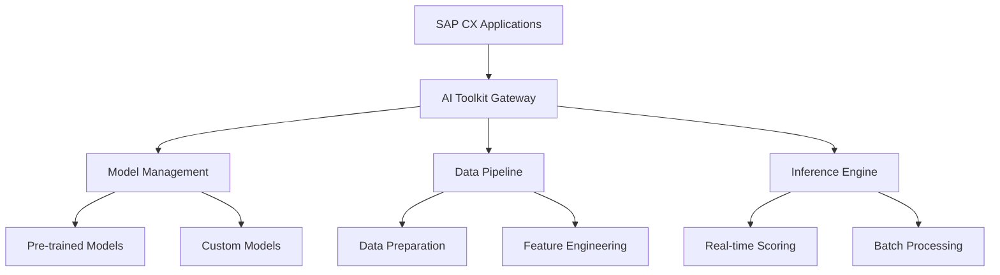

# SAP CX AI Toolkit: Practical Implementation Guide

The SAP CX AI Toolkit provides pre-built AI capabilities for Sales and Service Cloud applications. This guide covers practical implementation patterns, configuration strategies, and real-world use cases.

## Toolkit Overview

The CX AI Toolkit includes:
- **Predictive Analytics** for lead scoring and opportunity forecasting
- **Recommendation Engines** for next-best-action suggestions
- **Natural Language Processing** for sentiment analysis and text classification
- **Computer Vision** for document processing and image recognition
- **Conversational AI** for chatbots and virtual assistants

## Architecture Components



## Implementation Patterns

### 1. Lead Scoring Implementation

**Business Case:** Automatically score leads based on behavioral and demographic data

**Configuration:**
```json
{
  "modelConfig": {
    "name": "lead_scoring_v2",
    "type": "classification",
    "features": [
      "company_size",
      "industry_vertical", 
      "email_engagement_score",
      "website_activity_score",
      "social_media_presence",
      "geographic_region"
    ],
    "target": "conversion_probability",
    "threshold": 0.7
  },
  "dataSource": {
    "entity": "Lead",
    "refreshInterval": "hourly"
  }
}
```

**Integration Code:**
```javascript
// Lead scoring service integration
class LeadScoringService {
    async scoreLeads(leadIds) {
        const features = await this.extractFeatures(leadIds);
        
        const scoringRequest = {
            modelId: 'lead_scoring_v2',
            instances: features.map(f => ({
                leadId: f.leadId,
                features: f.featureVector
            }))
        };
        
        const response = await this.aiToolkit.predict(scoringRequest);
        
        // Update lead scores in CRM
        await this.updateLeadScores(response.predictions);
        
        return response;
    }
    
    async extractFeatures(leadIds) {
        // Extract and normalize features from multiple data sources
        const leads = await this.crmService.getLeads(leadIds);
        const activities = await this.activityService.getActivities(leadIds);
        const enrichment = await this.enrichmentService.getCompanyData(leadIds);
        
        return leads.map(lead => ({
            leadId: lead.id,
            featureVector: {
                company_size: this.normalizeCompanySize(enrichment[lead.id]?.employeeCount),
                industry_vertical: this.encodeIndustry(lead.industry),
                email_engagement_score: this.calculateEmailScore(activities[lead.id]),
                website_activity_score: this.calculateWebScore(activities[lead.id]),
                social_media_presence: enrichment[lead.id]?.socialScore || 0,
                geographic_region: this.encodeRegion(lead.country)
            }
        }));
    }
}
```

### 2. Sentiment Analysis for Service Cases

**Business Case:** Automatically detect customer sentiment in service interactions

**Model Configuration:**
```yaml
sentiment_model:
  name: "service_sentiment_v1"
  type: "text_classification"
  classes: ["positive", "neutral", "negative", "urgent"]
  preprocessing:
    - lowercase
    - remove_stopwords
    - lemmatization
  features:
    - tfidf_unigrams
    - tfidf_bigrams
    - emotion_keywords
```

**Implementation:**
```javascript
class SentimentAnalysisService {
    async analyzeCaseText(caseId, textContent) {
        // Preprocess text
        const cleanText = this.preprocessText(textContent);
        
        // Call AI Toolkit sentiment model
        const sentimentRequest = {
            modelId: 'service_sentiment_v1',
            text: cleanText,
            options: {
                includeConfidence: true,
                detectEmotions: true
            }
        };
        
        const result = await this.aiToolkit.analyzeSentiment(sentimentRequest);
        
        // Update case with sentiment data
        await this.updateCaseSentiment(caseId, result);
        
        // Trigger escalation if negative sentiment detected
        if (result.sentiment === 'negative' && result.confidence > 0.8) {
            await this.triggerEscalation(caseId, result);
        }
        
        return result;
    }
    
    async triggerEscalation(caseId, sentimentResult) {
        const escalationData = {
            caseId,
            reason: 'negative_sentiment_detected',
            confidence: sentimentResult.confidence,
            urgency: this.calculateUrgency(sentimentResult),
            suggestedActions: [
                'assign_senior_agent',
                'schedule_callback',
                'offer_compensation'
            ]
        };
        
        await this.escalationService.createEscalation(escalationData);
    }
}
```

### 3. Next-Best-Action Recommendations

**Business Case:** Suggest optimal actions for sales opportunities

**Recommendation Engine Setup:**
```json
{
  "recommendationConfig": {
    "name": "opportunity_nba",
    "algorithm": "collaborative_filtering",
    "features": [
      "opportunity_stage",
      "deal_size",
      "customer_segment",
      "product_interest",
      "competitor_presence",
      "sales_rep_experience"
    ],
    "actions": [
      "schedule_demo",
      "send_proposal", 
      "arrange_executive_meeting",
      "provide_reference_customer",
      "offer_pilot_program",
      "negotiate_pricing"
    ]
  }
}
```

**Service Implementation:**
```javascript
class NextBestActionService {
    async getRecommendations(opportunityId) {
        const opportunity = await this.getOpportunityContext(opportunityId);
        const historicalData = await this.getHistoricalPatterns(opportunity);
        
        const recommendationRequest = {
            modelId: 'opportunity_nba',
            context: {
                opportunityId,
                stage: opportunity.stage,
                dealSize: opportunity.amount,
                customerSegment: opportunity.account.segment,
                daysInStage: this.calculateDaysInStage(opportunity),
                competitorPresent: opportunity.competitors?.length > 0
            },
            candidateActions: this.getAvailableActions(opportunity),
            maxRecommendations: 3
        };
        
        const recommendations = await this.aiToolkit.recommend(recommendationRequest);
        
        // Enrich recommendations with business context
        return recommendations.map(rec => ({
            ...rec,
            rationale: this.generateRationale(rec, opportunity),
            expectedImpact: this.calculateExpectedImpact(rec, historicalData),
            effort: this.estimateEffort(rec),
            timeline: this.suggestTimeline(rec)
        }));
    }
    
    generateRationale(recommendation, opportunity) {
        const templates = {
            'schedule_demo': `Based on similar ${opportunity.account.segment} accounts, demos at this stage increase win rate by 34%`,
            'send_proposal': `Opportunity has been in ${opportunity.stage} for ${this.calculateDaysInStage(opportunity)} days, proposal timing is optimal`,
            'arrange_executive_meeting': `Deal size of ${opportunity.amount} typically requires executive sponsorship for approval`
        };
        
        return templates[recommendation.action] || 'AI model suggests this action based on historical patterns';
    }
}
```

## Advanced Use Cases

### 4. Document Intelligence for Contract Processing

**Use Case:** Extract key terms from sales contracts using computer vision

```javascript
class ContractIntelligenceService {
    async processContract(contractFile) {
        // Upload document to AI Toolkit
        const uploadResponse = await this.aiToolkit.uploadDocument({
            file: contractFile,
            documentType: 'sales_contract'
        });
        
        // Extract structured data
        const extractionRequest = {
            documentId: uploadResponse.documentId,
            extractionTemplate: 'sales_contract_v1',
            fields: [
                'contract_value',
                'start_date',
                'end_date',
                'payment_terms',
                'renewal_clause',
                'termination_conditions',
                'key_stakeholders'
            ]
        };
        
        const extractedData = await this.aiToolkit.extractData(extractionRequest);
        
        // Validate extracted data
        const validationResults = await this.validateExtraction(extractedData);
        
        // Create opportunity/quote records
        if (validationResults.confidence > 0.9) {
            await this.createOpportunityFromContract(extractedData);
        } else {
            await this.flagForManualReview(extractedData, validationResults);
        }
        
        return {
            extractedData,
            validationResults,
            processingStatus: validationResults.confidence > 0.9 ? 'automated' : 'manual_review'
        };
    }
}
```

### 5. Conversational AI for Customer Service

**Implementation:** Deploy chatbot with CX AI Toolkit integration

```javascript
class ServiceChatbotService {
    async handleCustomerMessage(customerId, message, sessionId) {
        // Get customer context
        const customerContext = await this.getCustomerContext(customerId);
        
        // Process message with NLP
        const nlpResult = await this.aiToolkit.processNaturalLanguage({
            text: message,
            context: customerContext,
            sessionId,
            intents: ['create_case', 'check_status', 'get_info', 'escalate']
        });
        
        // Route based on intent
        switch(nlpResult.intent) {
            case 'create_case':
                return await this.handleCaseCreation(nlpResult, customerContext);
            case 'check_status':
                return await this.handleStatusInquiry(nlpResult, customerContext);
            case 'escalate':
                return await this.handleEscalation(nlpResult, customerContext);
            default:
                return await this.handleGeneralInquiry(nlpResult, customerContext);
        }
    }
    
    async handleCaseCreation(nlpResult, customerContext) {
        // Extract case details from natural language
        const caseData = {
            subject: nlpResult.entities.subject || 'Customer inquiry via chatbot',
            description: nlpResult.originalText,
            priority: this.determinePriority(nlpResult.sentiment, nlpResult.entities),
            customerId: customerContext.customerId,
            channel: 'chatbot'
        };
        
        // Create case in Service Cloud
        const newCase = await this.serviceCloudAPI.createCase(caseData);
        
        // Generate response
        return {
            text: `I've created case ${newCase.caseNumber} for you. You should receive an email confirmation shortly.`,
            actions: [
                { type: 'view_case', caseId: newCase.id },
                { type: 'speak_to_agent' }
            ]
        };
    }
}
```

## Model Training and Customization

### Custom Model Development

```python
# Custom model training pipeline
class CustomModelTrainer:
    def __init__(self, toolkit_client):
        self.toolkit = toolkit_client
        
    def train_lead_scoring_model(self, training_data):
        # Prepare training dataset
        features, labels = self.prepare_training_data(training_data)
        
        # Configure model
        model_config = {
            'algorithm': 'gradient_boosting',
            'hyperparameters': {
                'n_estimators': 100,
                'learning_rate': 0.1,
                'max_depth': 6
            },
            'validation_split': 0.2,
            'cross_validation_folds': 5
        }
        
        # Train model
        training_job = self.toolkit.train_model(
            model_name='custom_lead_scoring',
            features=features,
            labels=labels,
            config=model_config
        )
        
        # Monitor training progress
        while training_job.status == 'running':
            metrics = self.toolkit.get_training_metrics(training_job.id)
            print(f"Accuracy: {metrics.accuracy}, Loss: {metrics.loss}")
            time.sleep(30)
        
        # Deploy model if performance meets threshold
        if training_job.final_accuracy > 0.85:
            self.toolkit.deploy_model(training_job.model_id, 'production')
        
        return training_job
```

## Performance Monitoring

### Model Performance Tracking

```javascript
class ModelPerformanceMonitor {
    async monitorModelPerformance() {
        const models = await this.aiToolkit.listModels();
        
        for (const model of models) {
            const metrics = await this.aiToolkit.getModelMetrics(model.id, {
                timeRange: '7d',
                includeDistribution: true
            });
            
            // Check for model drift
            if (metrics.accuracy < model.baselineAccuracy * 0.9) {
                await this.alertModelDrift(model, metrics);
            }
            
            // Check prediction distribution
            if (this.detectDistributionShift(metrics.predictionDistribution, model.baselineDistribution)) {
                await this.alertDistributionShift(model, metrics);
            }
            
            // Update monitoring dashboard
            await this.updateDashboard(model.id, metrics);
        }
    }
    
    async alertModelDrift(model, metrics) {
        const alert = {
            type: 'model_drift',
            modelId: model.id,
            currentAccuracy: metrics.accuracy,
            baselineAccuracy: model.baselineAccuracy,
            degradation: (model.baselineAccuracy - metrics.accuracy) / model.baselineAccuracy,
            recommendedAction: 'retrain_model'
        };
        
        await this.alertingService.sendAlert(alert);
    }
}
```

## Best Practices

### 1. Data Quality Management
- Implement data validation pipelines
- Monitor for data drift and quality issues
- Maintain feature store with versioning
- Regular data audits and cleansing

### 2. Model Governance
- Version control for all models
- A/B testing for model deployments
- Regular performance reviews
- Compliance with data privacy regulations

### 3. Integration Architecture
- Async processing for batch predictions
- Caching for frequently requested predictions
- Fallback mechanisms for model failures
- Comprehensive error handling and logging

### 4. User Experience
- Transparent AI decision explanations
- User feedback collection mechanisms
- Gradual rollout of AI features
- Human-in-the-loop for critical decisions

The SAP CX AI Toolkit provides powerful capabilities for enhancing customer experience through intelligent automation while maintaining enterprise-grade governance and reliability.