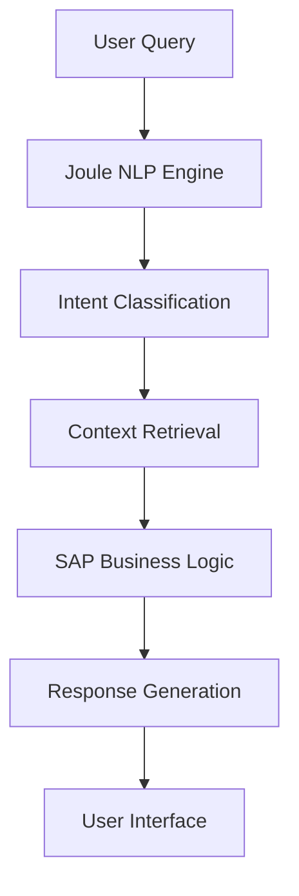

# SAP Joule: Enterprise AI Assistant Integration Patterns

SAP Joule represents a significant evolution in enterprise AI assistants, providing natural language interfaces to SAP business processes. This guide explores practical integration patterns and implementation strategies.

## Architecture Overview

Joule operates as a conversational layer over existing SAP applications, leveraging:
- **Natural Language Processing** for intent recognition
- **Business Context Awareness** from SAP data models
- **Role-Based Access Control** for secure interactions
- **Multi-Modal Interfaces** (chat, voice, embedded widgets)



## Integration Patterns

### 1. Embedded Assistant Pattern

**Use Case:** Contextual help within SAP applications
**Implementation:** Joule widget embedded in Sales Cloud V2 opportunity pages

```javascript
// Embed Joule in custom SAP UI5 application
sap.ui.define([
    "sap/ui/core/mvc/Controller",
    "sap/joule/Assistant"
], function (Controller, JouleAssistant) {
    "use strict";
    
    return Controller.extend("myapp.controller.OpportunityDetail", {
        onInit: function() {
            // Initialize Joule with opportunity context
            this.oJoule = new JouleAssistant({
                context: {
                    objectType: "Opportunity",
                    objectId: this.getView().getBindingContext().getProperty("ID")
                },
                suggestedActions: [
                    "Show similar opportunities",
                    "Generate proposal",
                    "Schedule follow-up"
                ]
            });
        }
    });
});
```

### 2. Workflow Automation Pattern

**Use Case:** Natural language workflow triggers
**Implementation:** Service case routing via conversational commands

```yaml
# Joule Workflow Configuration
workflows:
  - name: "escalate_case"
    trigger: 
      intent: "escalate"
      entities: ["case_id", "urgency_level"]
    actions:
      - validate_permissions
      - update_case_priority
      - notify_manager
      - log_escalation
    
  - name: "create_opportunity"
    trigger:
      intent: "create_opportunity"
      entities: ["account_name", "product", "value"]
    actions:
      - validate_account
      - create_opportunity_record
      - assign_sales_rep
      - schedule_follow_up
```

### 3. Analytics Query Pattern

**Use Case:** Natural language business intelligence
**Implementation:** Conversational reporting and KPI queries

```sql
-- Joule translates: "Show me top 5 customers by revenue this quarter"
-- Into optimized SAP HANA query:
SELECT 
    c.customer_name,
    SUM(o.net_value) as quarterly_revenue,
    COUNT(o.order_id) as order_count
FROM customers c
JOIN orders o ON c.customer_id = o.customer_id
WHERE o.order_date >= CURRENT_QUARTER_START
GROUP BY c.customer_id, c.customer_name
ORDER BY quarterly_revenue DESC
LIMIT 5;
```

## Implementation Strategies

### Phase 1: Foundation Setup

**1. Environment Preparation**
```bash
# Enable Joule in SAP BTP subaccount
cf enable-service-broker joule-broker
cf create-service joule standard joule-instance

# Configure authentication
cf bind-service myapp joule-instance
```

**2. Intent Training**
```json
{
  "intents": [
    {
      "name": "create_case",
      "examples": [
        "Create a new service case",
        "I need to log an issue",
        "Open a support ticket",
        "Report a problem with {product}"
      ]
    },
    {
      "name": "check_status", 
      "examples": [
        "What's the status of case {case_id}",
        "Show me my open cases",
        "Any updates on my tickets"
      ]
    }
  ]
}
```

### Phase 2: Business Logic Integration

**Service Layer Pattern:**
```javascript
// Joule Service Integration
class JouleBusinessService {
    async handleIntent(intent, entities, context) {
        switch(intent) {
            case 'create_case':
                return await this.createServiceCase(entities, context);
            case 'check_status':
                return await this.getCaseStatus(entities, context);
            default:
                return this.getDefaultResponse();
        }
    }
    
    async createServiceCase(entities, context) {
        // Validate user permissions
        if (!this.hasCreatePermission(context.userId)) {
            return "You don't have permission to create cases";
        }
        
        // Create case via SAP API
        const caseData = {
            subject: entities.subject,
            description: entities.description,
            priority: entities.priority || 'Medium',
            reporter: context.userId
        };
        
        const result = await this.sapService.createCase(caseData);
        return `Case ${result.caseId} created successfully`;
    }
}
```

### Phase 3: Advanced Capabilities

**Multi-Turn Conversations:**
```javascript
// Conversation state management
class ConversationManager {
    constructor() {
        this.sessions = new Map();
    }
    
    async processMessage(userId, message, sessionId) {
        let session = this.sessions.get(sessionId) || {
            context: {},
            step: 'initial'
        };
        
        switch(session.step) {
            case 'initial':
                if (message.intent === 'create_opportunity') {
                    session.step = 'collect_account';
                    return "Which account is this opportunity for?";
                }
                break;
                
            case 'collect_account':
                session.context.account = message.entities.account;
                session.step = 'collect_value';
                return "What's the estimated value?";
                
            case 'collect_value':
                session.context.value = message.entities.value;
                return await this.createOpportunity(session.context);
        }
        
        this.sessions.set(sessionId, session);
    }
}
```

## Security & Governance

### Access Control Integration
```javascript
// Role-based Joule capabilities
const jouleConfig = {
    roles: {
        'sales_rep': {
            allowedIntents: ['view_opportunities', 'create_activities', 'update_contacts'],
            dataScope: 'own_accounts'
        },
        'sales_manager': {
            allowedIntents: ['view_team_performance', 'approve_discounts', 'reassign_accounts'],
            dataScope: 'team_accounts'
        },
        'service_agent': {
            allowedIntents: ['create_case', 'update_case', 'search_knowledge'],
            dataScope: 'assigned_cases'
        }
    }
};
```

### Audit Trail
```javascript
// Log all Joule interactions for compliance
class JouleAuditLogger {
    async logInteraction(userId, intent, entities, response, timestamp) {
        const auditRecord = {
            userId,
            intent,
            entities: this.sanitizeEntities(entities),
            responseType: response.type,
            timestamp,
            sessionId: this.getCurrentSession(userId)
        };
        
        await this.auditService.log(auditRecord);
    }
}
```

## Performance Optimization

### Caching Strategy
```javascript
// Cache frequent queries for faster responses
class JouleCacheManager {
    constructor() {
        this.cache = new Map();
        this.ttl = 300000; // 5 minutes
    }
    
    async getCachedResponse(query) {
        const key = this.generateKey(query);
        const cached = this.cache.get(key);
        
        if (cached && Date.now() - cached.timestamp < this.ttl) {
            return cached.response;
        }
        
        return null;
    }
}
```

### Response Optimization
```javascript
// Optimize response generation
class ResponseOptimizer {
    async generateResponse(intent, data) {
        // Use templates for consistent formatting
        const template = this.getTemplate(intent);
        
        // Limit data size for mobile clients
        const optimizedData = this.optimizeForClient(data);
        
        // Generate contextual suggestions
        const suggestions = await this.getSuggestions(intent, data);
        
        return {
            text: template.render(optimizedData),
            suggestions,
            actions: this.getQuickActions(intent)
        };
    }
}
```

## Best Practices

### 1. Intent Design
- Keep intents focused and specific
- Provide diverse training examples
- Handle edge cases gracefully
- Regular retraining with real user data

### 2. User Experience
- Clear conversation flows
- Fallback to human agents when needed
- Contextual help and suggestions
- Multi-modal interaction support

### 3. Integration Architecture
- Loose coupling with SAP services
- Async processing for complex operations
- Proper error handling and recovery
- Comprehensive logging and monitoring

### 4. Governance
- Regular intent performance reviews
- User feedback collection and analysis
- A/B testing for conversation flows
- Compliance with data privacy regulations

## Measuring Success

**Key Metrics:**
- Intent recognition accuracy (target: >90%)
- Task completion rate (target: >80%)
- User satisfaction scores
- Reduction in support tickets
- Time saved per interaction

**Monitoring Dashboard:**
```javascript
// Joule analytics integration
const analytics = {
    intentAccuracy: await this.getIntentAccuracy(),
    completionRate: await this.getTaskCompletionRate(),
    userSatisfaction: await this.getUserSatisfactionScore(),
    usageVolume: await this.getUsageMetrics()
};
```

SAP Joule represents the future of enterprise AI interaction, enabling natural language interfaces to complex business processes while maintaining enterprise-grade security and governance.