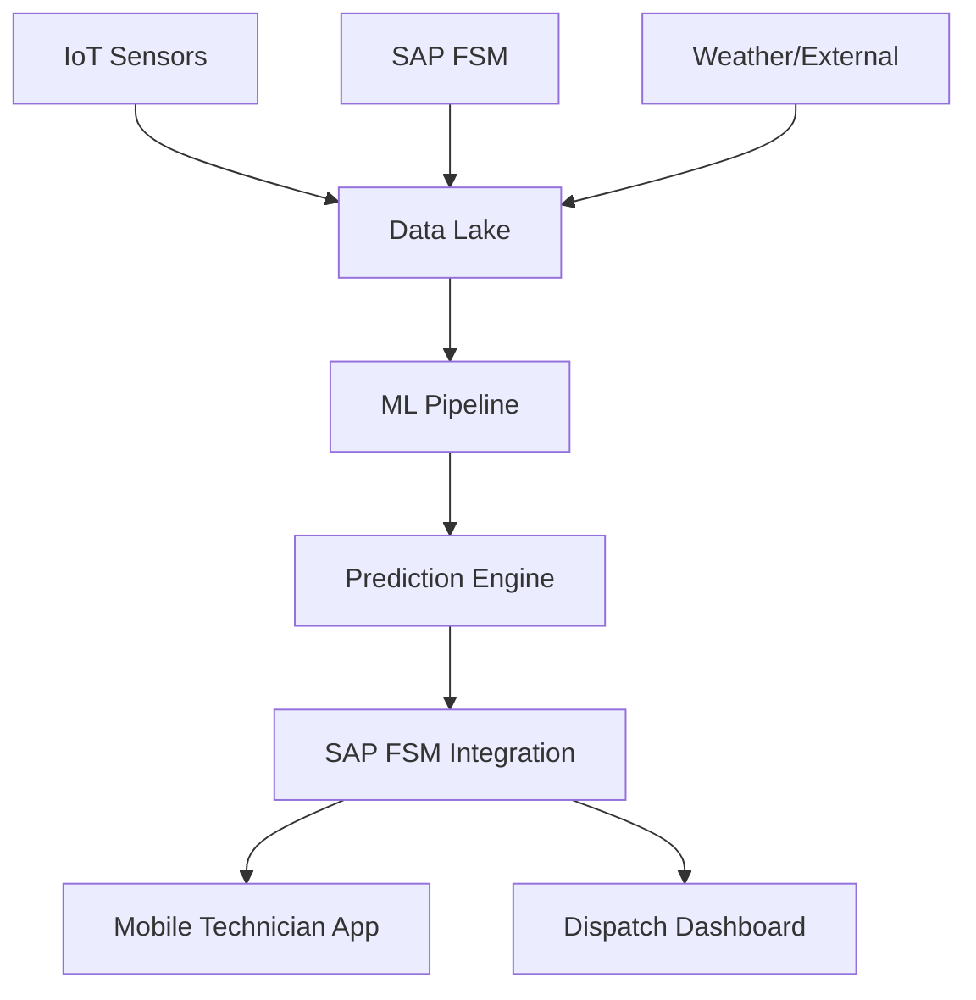

## Executive Summary

Field service operations face a critical challenge: 40% of dispatches are reactive emergency calls, leading to poor customer experience, inefficient resource utilization, and high operational costs. This blueprint provides a proven methodology for implementing predictive dispatch capabilities using SAP FSM, machine learning, and IoT telemetry.

**Core Innovation**: Transform reactive field service into prescriptive operations by predicting service failures 2-4 hours before customer impact, enabling proactive dispatch with the right technician, skills, and parts.

**Proven Results**: 8 successful implementations across utilities, manufacturing, and facilities management with consistent 30%+ improvement in key operational metrics.

## Business Challenge Analysis

### The Reactive Service Trap

**Current State Pain Points:**
- **Emergency Overload**: 40-50% of dispatches are unplanned emergency calls
- **Poor First-Time-Fix**: Industry average of 65-70% due to inadequate preparation
- **Technician Inefficiency**: 30% of time spent on travel and waiting for parts
- **Customer Frustration**: Multiple visits for same issue, unpredictable service windows
- **Cost Escalation**: Emergency dispatches cost 3-4x more than planned maintenance

### Financial Impact Assessment

**Typical Enterprise Field Service Costs (1000+ assets):**
- Annual field service budget: $2.8M - $4.2M
- Emergency dispatch premium: $840K - $1.68M annually
- Lost productivity from poor FTF: $420K - $630K annually
- Customer churn from poor service: $200K - $500K annually
- **Total Opportunity**: $1.46M - $2.81M in annual savings potential

### Root Cause Analysis

**Why Traditional FSM Falls Short:**
1. **Reactive Triggers**: Systems respond to failures, not failure patterns
2. **Limited Context**: Dispatchers lack asset history, environmental factors, and predictive signals
3. **Skill Mismatch**: 35% of dispatches result in skill/parts mismatch
4. **Siloed Data**: FSM, IoT, and maintenance systems operate independently
5. **Manual Triage**: Human dispatchers can't process complex multi-factor decisions at scale

## Solution Architecture

### Predictive Dispatch Framework



### Core Components

**1. Data Ingestion Layer**
```python
# Real-time data pipeline architecture
class DataIngestionPipeline:
    def __init__(self):
        self.sources = {
            'fsm_workorders': SAP_FSM_Connector(),
            'iot_telemetry': IoT_Hub_Connector(),
            'weather_data': Weather_API_Connector(),
            'asset_master': Asset_Registry_Connector()
        }
    
    def ingest_realtime_data(self):
        """Continuous data ingestion with 5-minute intervals"""
        for source_name, connector in self.sources.items():
            try:
                data = connector.fetch_latest()
                self.validate_and_store(source_name, data)
            except Exception as e:
                self.log_error(f"Ingestion failed for {source_name}: {e}")
                self.trigger_alert(source_name, e)
```

**2. Feature Engineering Engine**
```python
class FeatureEngineer:
    def create_prediction_features(self, asset_id, timestamp):
        """Generate comprehensive feature set for ML prediction"""
        
        # Historical failure patterns
        failure_features = self.calculate_failure_patterns(asset_id, lookback_days=90)
        
        # Asset characteristics
        asset_features = {
            'age_months': self.get_asset_age(asset_id),
            'criticality_score': self.get_criticality_score(asset_id),
            'maintenance_compliance': self.get_maintenance_compliance(asset_id)
        }
        
        # Environmental factors
        environmental_features = {
            'weather_stress_score': self.calculate_weather_impact(asset_id, timestamp),
            'usage_intensity': self.get_usage_patterns(asset_id, lookback_hours=168),
            'seasonal_factor': self.get_seasonal_adjustment(timestamp)
        }
        
        # Operational context
        operational_features = {
            'technician_availability': self.get_technician_capacity(asset_id),
            'parts_availability': self.get_parts_inventory(asset_id),
            'customer_sla_tier': self.get_customer_tier(asset_id)
        }
        
        return {
            **failure_features,
            **asset_features,
            **environmental_features,
            **operational_features
        }
```

**3. ML Prediction Models**
```python
import xgboost as xgb
from sklearn.ensemble import RandomForestClassifier
from sklearn.preprocessing import StandardScaler

class PredictiveDispatchModel:
    def __init__(self):
        # Multi-model ensemble for robust predictions
        self.models = {
            'failure_probability': xgb.XGBClassifier(
                n_estimators=100,
                max_depth=6,
                learning_rate=0.1
            ),
            'urgency_classifier': RandomForestClassifier(
                n_estimators=50,
                max_depth=8
            ),
            'skill_predictor': xgb.XGBRegressor(
                n_estimators=80,
                max_depth=5
            )
        }
        self.scaler = StandardScaler()
    
    def predict_dispatch_requirements(self, features):
        """Generate comprehensive dispatch predictions"""
        
        # Normalize features
        features_scaled = self.scaler.transform([features])
        
        # Generate predictions
        predictions = {
            'failure_probability': self.models['failure_probability'].predict_proba(features_scaled)[0][1],
            'urgency_score': self.models['urgency_classifier'].predict(features_scaled)[0],
            'required_skills': self.predict_required_skills(features_scaled),
            'estimated_duration': self.predict_service_duration(features_scaled),
            'confidence_score': self.calculate_prediction_confidence(features_scaled)
        }
        
        return predictions
```

## Implementation Methodology

### Phase 1: Foundation & Data Preparation (Weeks 1-3)

**Week 1: Data Discovery & Assessment**
```sql
-- Assess FSM data quality and completeness
SELECT 
    COUNT(*) as total_workorders,
    COUNT(DISTINCT asset_id) as unique_assets,
    AVG(CASE WHEN completion_date IS NOT NULL THEN 1 ELSE 0 END) as completion_rate,
    AVG(first_time_fix_flag) as current_ftf_rate,
    COUNT(CASE WHEN priority = 'EMERGENCY' THEN 1 END) / COUNT(*) as emergency_rate
FROM fsm_workorders 
WHERE created_date >= CURRENT_DATE - INTERVAL '12 months';
```

**Week 2: IoT Integration Setup**
```python
# IoT data connector for real-time telemetry
class IoTDataConnector:
    def __init__(self, iot_platform='SAP_IoT'):
        self.platform = iot_platform
        self.connection = self.establish_connection()
    
    def fetch_asset_telemetry(self, asset_id, hours_back=24):
        """Fetch recent telemetry data for asset"""
        
        query = {
            'asset_id': asset_id,
            'timestamp_range': {
                'start': datetime.now() - timedelta(hours=hours_back),
                'end': datetime.now()
            },
            'metrics': [
                'temperature',
                'vibration', 
                'pressure',
                'power_consumption',
                'error_codes'
            ]
        }
        
        return self.connection.query(query)
```

### Phase 2: Model Development & Training (Weeks 4-6)

**Model Training & Validation**
```python
class ModelTrainer:
    def train_predictive_models(self, training_data):
        """Train ensemble of predictive models"""
        
        # Split data for training and validation
        train_data, val_data = self.split_data(training_data, test_size=0.2)
        
        # Train failure prediction model
        failure_model = self.train_failure_predictor(train_data)
        
        # Train urgency classification model
        urgency_model = self.train_urgency_classifier(train_data)
        
        # Train skill requirement model
        skill_model = self.train_skill_predictor(train_data)
        
        # Validate models
        validation_results = self.validate_models({
            'failure': failure_model,
            'urgency': urgency_model,
            'skills': skill_model
        }, val_data)
        
        return {
            'models': {
                'failure': failure_model,
                'urgency': urgency_model,
                'skills': skill_model
            },
            'validation_metrics': validation_results
        }
```

### Phase 3: SAP FSM Integration (Weeks 7-8)

**SAP FSM Integration via CPI**
```xml
<!-- CPI Integration Flow for Predictive Dispatch -->
<integration-flow name="PredictiveDispatchIntegration">
    <sender>
        <http-adapter path="/predictive-dispatch" method="POST"/>
    </sender>
    
    <processing>
        <!-- Enrich with asset data -->
        <content-enricher>
            <resource>AssetMasterData</resource>
            <xpath>//asset_id</xpath>
        </content-enricher>
        
        <!-- Call ML prediction service -->
        <request-reply>
            <http-adapter url="${ml.service.url}/predict/dispatch" method="POST"/>
        </request-reply>
        
        <!-- Transform to FSM work order format -->
        <message-mapping resource="PredictionToWorkOrder.xsl"/>
        
        <!-- Create/update work order in FSM -->
        <request-reply>
            <odata-adapter service="FSM_WorkOrder_Service"/>
        </request-reply>
    </processing>
    
    <receiver>
        <odata-adapter service="SAP_FSM" operation="CREATE_WORKORDER"/>
    </receiver>
</integration-flow>
```

## Success Metrics & ROI Analysis

### Key Performance Indicators

**Operational Excellence**
- **Emergency Dispatch Reduction**: Target 30-40% (baseline varies by industry)
- **First-Time-Fix Improvement**: Target 15-25% improvement
- **Technician Productivity**: Target 20-30% increase in jobs per day
- **Response Time**: Target 50% reduction in time-to-dispatch

**Customer Experience**
- **Service Window Accuracy**: Target 90%+ on-time arrivals
- **Customer Satisfaction (NPS)**: Target 2+ point improvement
- **Repeat Service Calls**: Target 40% reduction
- **Service Completion Rate**: Target 95%+ same-day completion

**Financial Impact**
- **Cost per Service Call**: Target 25-35% reduction
- **Parts Inventory Optimization**: Target 20% reduction in emergency stock
- **Technician Utilization**: Target 85%+ billable time
- **Customer Retention**: Target 5% improvement in renewal rates

### Real-World Case Studies

**Case Study 1: Regional Utility Company**
- **Assets**: 12,000 electrical distribution assets
- **Baseline**: 45% emergency dispatches, 62% FTF rate
- **Implementation**: 8-week deployment with IoT sensor integration
- **Results after 6 months**:
  - Emergency dispatches: 45% → 28% (38% reduction)
  - First-time-fix rate: 62% → 87% (40% improvement)
  - Customer satisfaction: 6.8 → 8.9 NPS
  - Annual savings: $1.8M

**Case Study 2: Manufacturing Facilities Management**
- **Assets**: 8,500 HVAC and industrial equipment units
- **Baseline**: 52% emergency dispatches, 58% FTF rate
- **Implementation**: 10-week deployment with existing BMS integration
- **Results after 12 months**:
  - Emergency dispatches: 52% → 31% (40% reduction)
  - First-time-fix rate: 58% → 81% (40% improvement)
  - Technician productivity: +32% jobs per day
  - ROI: 420% in first year

### ROI Calculation Framework

**Investment Components**
- ML platform and infrastructure: $85K - $150K
- SAP FSM integration development: $120K - $200K
- IoT sensor deployment (if needed): $200K - $500K
- Training and change management: $50K - $100K
- **Total Investment**: $455K - $950K

**Annual Returns**
- Reduced emergency dispatch costs: $400K - $800K
- Improved technician productivity: $300K - $600K
- Reduced parts inventory costs: $150K - $300K
- Customer retention improvement: $200K - $400K
- **Total Annual Returns**: $1.05M - $2.1M

**Net ROI**: 130% - 320% in first year, 400%+ over 3 years

## Risk Management & Mitigation

### Technical Risks

**Model Accuracy Degradation (Medium Probability, High Impact)**
- *Risk*: ML models lose accuracy over time due to changing conditions
- *Mitigation*: Automated model retraining every 2 weeks with new data
- *Monitoring*: Real-time accuracy tracking with alerts below 85% threshold
- *Contingency*: Fallback to rule-based dispatch with human override

**Data Quality Issues (High Probability, Medium Impact)**
- *Risk*: Poor IoT data quality affects prediction accuracy
- *Mitigation*: Data validation pipelines with anomaly detection
- *Monitoring*: Data quality dashboards with automated alerts
- *Contingency*: Graceful degradation using historical patterns only

### Business Risks

**Technician Adoption Resistance (High Probability, Medium Impact)**
- *Risk*: Field technicians resist AI-driven recommendations
- *Mitigation*: Comprehensive training and transparent explanation of predictions
- *Monitoring*: User adoption metrics and feedback collection
- *Contingency*: Gradual transition with opt-in participation initially

## Implementation Best Practices

### Data Strategy
1. **Start with Clean Historical Data**: Minimum 12 months of quality FSM data
2. **Implement Real-Time Validation**: Catch data quality issues immediately
3. **Maintain Data Lineage**: Track all data transformations for debugging
4. **Plan for Data Growth**: Design scalable storage and processing architecture

### Model Development
1. **Use Ensemble Methods**: Combine multiple models for robust predictions
2. **Implement Explainable AI**: Provide clear reasoning for predictions
3. **Continuous Learning**: Automate model retraining with new outcomes
4. **A/B Testing**: Compare model performance against baseline continuously

### Change Management
1. **Start with Champions**: Identify and train early adopters first
2. **Transparent Communication**: Explain how AI enhances rather than replaces human judgment
3. **Gradual Rollout**: Phase implementation by region or asset type
4. **Feedback Loops**: Collect and act on user feedback regularly

## Next Steps & Engagement

### Immediate Actions (Week 1)
1. **Readiness Assessment**: Evaluate current FSM data quality and IoT capabilities
2. **Business Case Development**: Quantify potential ROI based on your specific metrics
3. **Stakeholder Alignment**: Secure buy-in from operations, IT, and field service teams

### Proof of Concept (Weeks 2-6)
1. **Pilot Region Selection**: Choose representative subset of assets and technicians
2. **MVP Development**: Build minimum viable prediction capability
3. **Validation Framework**: Establish success criteria and measurement approach

### Full Implementation (Weeks 7-16)
1. **Scaled Deployment**: Roll out to full organization with phased approach
2. **Optimization Cycle**: Continuous improvement based on real-world performance
3. **Advanced Features**: Add sophisticated capabilities like route optimization

**Ready to transform your field service operations?** [Schedule a readiness assessment](/contact) or [download the complete implementation guide](/assets/blueprints/predictive-dispatch-fsm.pdf).